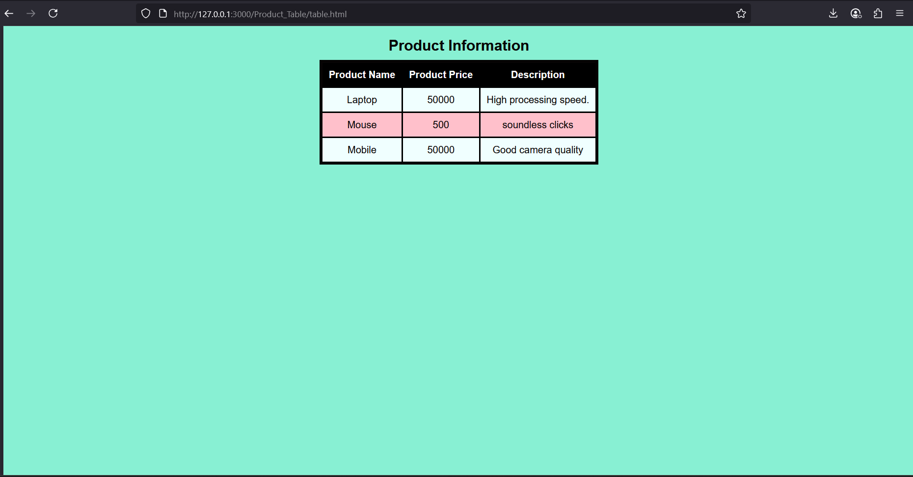

# Product Table
## Date: 07-07-2025
## Objective:

To create a structured HTML table that displays product-related information, including product names, prices, and descriptions, useful for catalogs, listings, or e-commerce prototypes.

## Tasks:

### 1. Set Up the Basic HTML Structure:

Use ```<!DOCTYPE html>```, ```<html>```, ```<head>```, and ```<body>``` tags to define the document layout.

Include a ```<title>``` such as "Product Table".

### 2. Create a Table Element:

Use the ```<table>``` tag to begin the product table.

### 3. Add a Table Header:

Use the ```<thead>``` section with a ```<tr>``` row and three ```<th>``` elements:

Product Name

Product Price

Description

### 4. Insert Table Body Rows:

Use the ```<tbody>``` section with multiple ```<tr>``` rows.

In each row, use three ```<td>``` cells for:

The name of the product (e.g., Laptop, Phone)

The price (e.g., ₹45,000, $499)

A short description (e.g., "High-speed performance", "Budget-friendly")

### 5. Ensure Semantic Structure:

Include ```<caption>``` if needed to describe the table purpose.

Use meaningful text inside the table for clarity.

### 6. No CSS or JavaScript:

Keep the table design strictly in HTML for simplicity.
## HTML Code:
```
<!DOCTYPE html>
<html lang="en">
<head>
    <meta charset="UTF-8">
    <meta name="viewport" content="width=device-width, initial-scale=1.0">
    <title>Product Table</title>
</head>
<body>
    <table cellspacing="5" cellpadding="5" border="5">
        <caption>Product Information</caption>
        <thead>
            <tr>
                <th>Product Name</th>
                <th>Product Price</th>
                <th>Description</th>
            </tr>
        </thead>
        <tbody>
            <tr>
                <td>Laptop</td>
                <td>50000</td>
                <td>High processing speed.</td>
            </tr>
            <tr>
                <td>Mouse</td>
                <td>500</td>
                <td>soundless clicks</td>
            </tr>
            <tr>
                <td>Mobile</td>
                <td>50000</td>
                <td>Good camera quality</td>
            </tr>
        </tbody>
    </table>
</body>
</html>
```

## Output:


## Result:
A structured HTML table that displays product-related information, including product names, prices, and descriptions, useful for catalogs, listings, or e-commerce prototypes is created successfully.
